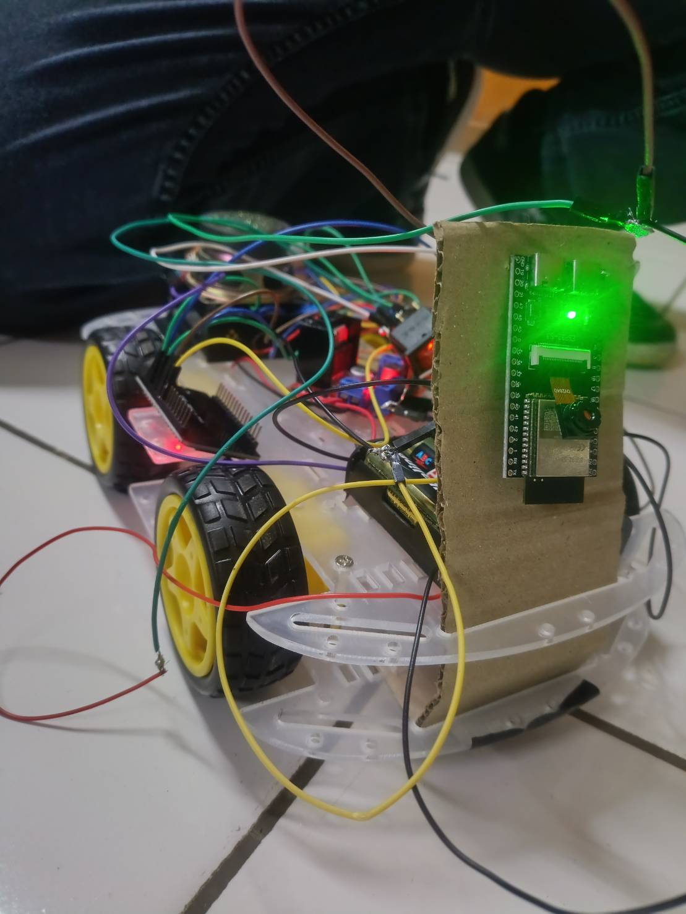
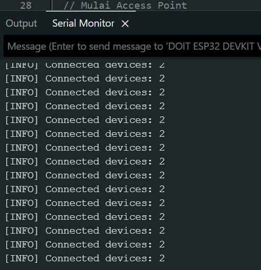
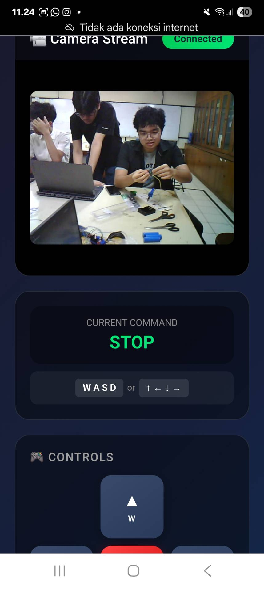
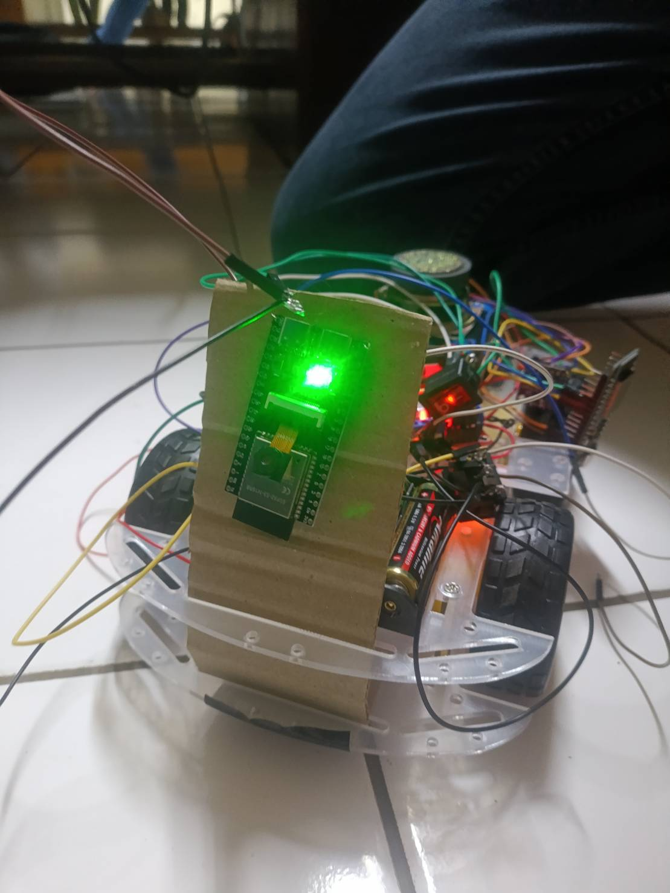
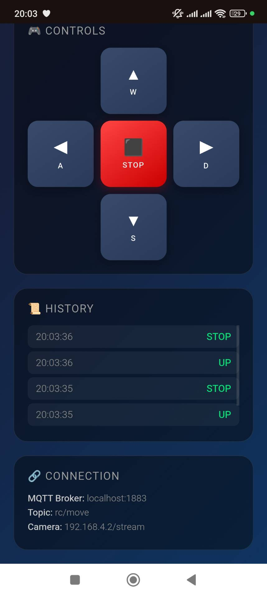
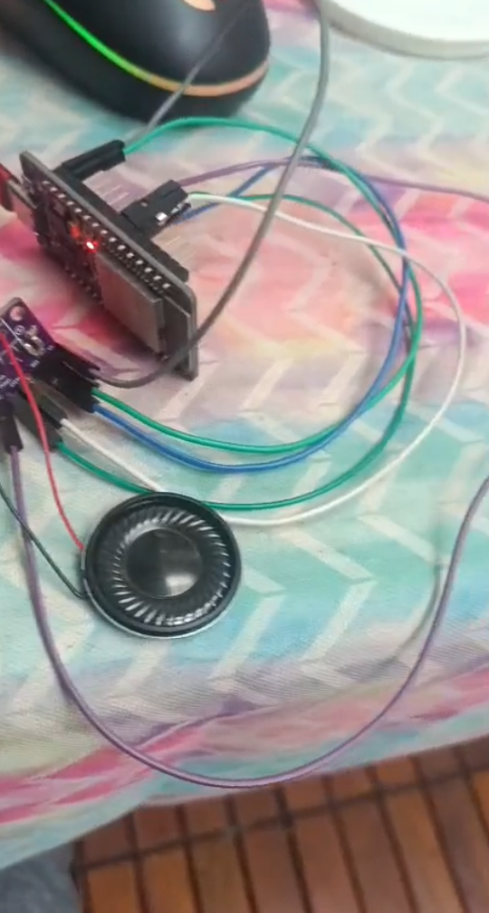

# Charlie Kark IOT

**KELOMPOK 12**

- Alexander Christhian (2306267025)
- Daffa Sayra Firdaus (2306267151)
- Jesaya David GNP (2306161965)
- Farhan Ramadhani Zakiyyandi (2306220412)

---

## Introduction

### Problem Statement

In the current digital and IoT era, there is an increasing need for remote control systems that can operate in real-time with visual feedback. Applications such as exploration robots, surveillance systems, and remote-controlled vehicles require several critical capabilities:

1. **Real-Time Control**: The system must respond to user commands with minimal latency to ensure precise and responsive control.

2. **Real-Time Video Streaming**: Operators require direct visual feedback from the camera for effective navigation and surveillance, with minimal delay between capture and display.

3. **Reliable Wireless Connectivity**: The system must operate wirelessly with adequate range and stable connection.

4. **Multi-Tasking Capability**: The system must handle multiple tasks simultaneously (motor control, video streaming, audio playback, network communication) without performance degradation.

5. **Control Platform Flexibility**: Users must be able to control the system from various devices (PC, smartphone, tablet) with a user-friendly interface.

6. **Power Efficiency**: With battery power limitations, the system must be optimized for efficient power consumption.

The main challenge is integrating all these components into a cohesive, reliable, and cost-effective system using an embedded system platform.

### Proposed Solution

We developed an IoT-Based Remote Controlled Car system with a distributed three-ESP32 architecture:

**System Architecture:**

1. **ESP32 Root (Access Point)**: Functions as the central WiFi Access Point connecting all system components. Uses power saving mode for power efficiency.

2. **ESP32 Camera Module**: Dedicated to video streaming using OV2640/OV5640 camera with MJPEG streaming over HTTP. Accessible via mDNS (camcar.local) for easy configuration.

3. **ESP32 Controller (RTOS)**: Uses FreeRTOS for multi-tasking:

   - **Core 0**: Motor control task for low-latency response
   - **Core 1**: Network tasks (Blynk/MQTT) for communication
   - Bluetooth A2DP sink for audio playback via I2S
   - Dual control mode: Blynk Cloud (primary) with MQTT fallback

4. **Web-Based Control Interface**: Flask server with responsive HTML5 interface supporting:
   - WASD/Arrow keys keyboard control
   - Touch-friendly button controls for mobile
   - Real-time camera stream display
   - MQTT communication for command transmission
   - Command history and connection status monitoring

**Key Technologies:**

- FreeRTOS for real-time task scheduling and inter-task communication via queues
- MQTT protocol for lightweight, reliable messaging
- Blynk IoT platform for cloud-based control with mobile app support
- mDNS for service discovery without hardcoded IP addresses
- I2S protocol for high-quality audio output
- Power saving modes (WiFi modem sleep, Bluetooth disable) for battery efficiency

### Acceptance Criteria

The success criteria for this project are determined as follows:

1. The system must be able to move like a car or other four-wheeled vehicle. The requirements for this capability are that the system can move forward, backward, and turn left and right.

2. The system must be controllable remotely using a WASD control system via website from both smartphone and PC, and must support control from keyboard and any device.

3. The system must be able to send camera-recorded video to the control device, with minimal delay between the time the recording is captured by the camera and the time the video information is displayed on the control device.

4. The system must also be able to produce sound without interfering with vehicle operation.

### Roles and Responsibilities

| Role   | Responsibilities                                       | Person                      |
| ------ | ------------------------------------------------------ | --------------------------- |
| Role 1 | Project Manager, Hardware Designer + Soldering. Camera | Alexander Christhian        |
| Role 2 | Network, MQTT, RTOS implementation                     | Daffa Sayra Firdaus         |
| Role 3 | Bluetooth & Speaker Configuration                      | Jesaya David Gamalael N P   |
| Role 4 | Project documentation writing                          | Farhan Ramadhani Zakiyyandi |

---

## Implementation

### Hardware Design

Hardware design was carried out to build the project circuit into a form that can achieve all our desired objectives. First, for the remotely controlled vehicle, we built the vehicle from the Smart Chassis 4WD Robot Car Kit, an assembly kit for robot cars that has compatibility with Arduino and Raspberry Pi, which means this robot car supports boards commonly used for IoT systems. Then, as the motor driver, we used the Dual H-Bridge Stepper Driver Motor L298N as the central controller, which drives the wheels of the robot car. To power the motors that drive this robot car, we used rechargeable 18650 lithium batteries. As the central control of this robot car, we used an ESP32-S3 WROOM N16R8 CAM module board due to our experience using ESP32 boards for IoT purposes during recent semesters, and among the boards used for IoT purposes, the ESP32 board is the most powerful in available features, such as memory size, RAM size, and clock speed. Not only that, the module also has support for OV2640/OV5640 cameras which we need to use for this project as a camera that will send data to the control device.

In addition to the controlled vehicle, we also need a device to control it. The control device, because it is connected to the vehicle wirelessly, can actually be any device, such as a keyboard, controller, laptop, or smartphone. However, the important thing needed in controlling the vehicle through its control device is the presence of WASD keys, a series of keys that are basically the same as the up-down-left-right arrow controls on a remote control.

### Software Development

Software development was carried out on three main components:

**A. ESP32 Root (esp_root.cpp)**

Functions as WiFi Access Point with configuration:

- SSID: "RC_CAR_AP", Password: "12345678"
- Static IP: 192.168.4.1 (gateway and local IP)
- Subnet mask: 255.255.255.0
- Power saving: Bluetooth disabled, WiFi modem sleep mode enabled
- Monitoring: Periodic check for number of connected devices every 10 seconds
- Light sleep mode when idle to save power

**B. ESP32 Camera (esp_cam.cpp)**

Handles video streaming with features:

- Camera initialization with pin configuration for ESP32-S3 Wrover
- Frame size: VGA (640x480) with PSRAM, SVGA without PSRAM
- JPEG quality: 10-12 for balance between quality and bandwidth
- HTTP server on port 80 with /stream endpoint
- MJPEG streaming using multipart/x-mixed-replace
- mDNS responder: "camcar.local" for easy access
- Power optimization: Bluetooth disabled, WiFi power save enabled

**C. ESP32 Controller RTOS (esp_controller_rtos.cpp)**

FreeRTOS implementation with multi-task architecture:

_Task Architecture:_

1. **Motor Task (Core 0, Priority 1)**:

   - Receives commands from queue (blocking wait)
   - Controls 4 motor pins via L298N driver
   - Command mapping: UP/W (forward), DOWN/S (backward), LEFT/A (left), RIGHT/D (right), STOP
   - Direct GPIO control for low-latency response

2. **Blynk Task (Core 1, Priority 2)** - Primary mode:

   - Virtual pins: V0 (UP), V1 (DOWN), V2 (LEFT), V3 (RIGHT), V4 (STOP)
   - Connection monitoring and auto-reconnect
   - Non-blocking Blynk.run() with 10ms delay

3. **MQTT Task (Core 1, Priority 2)** - Fallback mode:
   - Subscribe to topic "rc/move"
   - Auto-reconnect with random client ID
   - Callback processing and queue insertion

_Control Flow:_

- Startup: Attempt Blynk connection with 10 second timeout
- If Blynk succeeds: Create Blynk task, set useBlynk = true
- If Blynk fails: Create MQTT task, fallback to MQTT mode
- Inter-task communication via FreeRTOS queue (10 command buffer)

_Bluetooth Audio (I2S):_

- A2DP sink profile to receive audio from smartphone
- I2S configuration: 44.1kHz, 16-bit stereo
- Pin mapping: LRC (25), BCLK (33), DIN (32)
- Callback-based audio data streaming to I2S driver

**D. Web Control Server (Python Flask)**

Server-side application with features:

- Flask web framework for HTTP server
- MQTT client (paho-mqtt) for communication with ESP32
- REST API endpoints:
  - GET /: Serve HTML interface
  - GET /api/status: Return MQTT connection status and command history
  - POST /api/move: Send movement command via MQTT
- Command logging with timestamp (last 10 commands)
- Real-time status monitoring

**E. Web Interface (HTML/JavaScript)**

Client-side responsive web application:

- Grid layout: Video stream (left) + Control panel (right)
- Keyboard event handling: WASD and Arrow keys with key repeat prevention
- Mouse/Touch controls: Button press/release with visual feedback
- Real-time updates: Status polling every 2 seconds
- Camera stream: Embedded image with 180° rotation
- Visual indicators: Connection status badge, current command display, command history
- Responsive design: Mobile-friendly with touch event support

### Integration of Software and Hardware

System integration was carried out through several stages:

**A. Firmware Upload to ESP32 Modules**

1. **Development Environment**: PlatformIO IDE (extension for VS Code)

   - Platform: espressif32
   - Framework: Arduino
   - Board: esp32-s3-devkitc-1 (for controller and camera)
   - Board: esp32dev (for root AP)

2. **Upload Process**:

   - Connect ESP32 to laptop via USB-C cable
   - Compile firmware with PlatformIO
   - Upload binary to ESP32 flash memory
   - Monitor serial output for debugging

3. **Library Dependencies**:
   - ESP32 Camera driver (esp_camera.h)
   - Blynk library for IoT cloud connectivity
   - PubSubClient for MQTT protocol
   - ESP32 Bluetooth A2DP library
   - FreeRTOS (built-in ESP-IDF)

**B. Hardware Wiring**

1. **ESP32 Controller to Motor Driver L298N**:

   - GPIO 26 → IN1 (Left Motor Backward)
   - GPIO 27 → IN2 (Left Motor Forward)
   - GPIO 14 → IN3 (Right Motor Forward)
   - GPIO 12 → IN4 (Right Motor Backward)
   - L298N powered by 18650 Li-ion batteries

2. **ESP32 Controller to I2S Audio (MAX98357A/PCM5102)**:

   - GPIO 25 → LRC (Word Select)
   - GPIO 33 → BCLK (Bit Clock)
   - GPIO 32 → DIN (Data In)
   - Speaker output from I2S DAC module

3. **ESP32 Camera Module**:
   - Pre-configured camera pins (Y2-Y9, XCLK, PCLK, VSYNC, HREF)
   - OV2640/OV5640 camera module connection
   - Power supply from USB or battery

**C. Network Configuration**

1. **WiFi Network Setup**:

   - ESP32 Root creates AP "RC_CAR_AP" (192.168.4.1)
   - ESP32 Camera connects to AP, gets IP via DHCP
   - ESP32 Controller connects to AP, gets IP via DHCP
   - Laptop/smartphone connects to AP for control

2. **Service Discovery**:
   - Camera accessible via mDNS: http://camcar.local/stream
   - Eliminates need for hardcoded IP addresses
   - Automatic service resolution on network

**D. Control Server Setup**

1. **Mosquitto MQTT Broker** (on laptop):

   - Install Mosquitto broker for Windows
   - Configuration file: mosquitto.conf
   - Listen on port 1883 (default MQTT port)
   - Allow anonymous connections for testing

2. **Flask Web Server**:
   - Install Python dependencies: Flask, paho-mqtt
   - Run server: `python app.py`
   - Access via browser: http://localhost:5000
   - Server listens on 0.0.0.0:5000 (accessible from network)

**E. Integration Testing**

1. Power up sequence:

   - Start ESP32 Root (AP must be active first)
   - Start ESP32 Camera (wait for WiFi connection)
   - Start ESP32 Controller (wait for WiFi and Blynk/MQTT)
   - Start Mosquitto broker on laptop
   - Start Flask server

2. Verification:
   - Check serial monitor for connection status
   - Verify camera stream accessible in browser
   - Test motor control via web interface
   - Test Bluetooth audio pairing and playback
   - Monitor MQTT message flow

**F. Blynk Cloud Integration** (Optional Primary Mode):

1. Create Blynk project with template ID
2. Configure virtual pins (V0-V4) with button widgets
3. ESP32 connects to Blynk cloud via WiFi
4. Control via Blynk mobile app or web dashboard
5. Automatic fallback to MQTT if Blynk unavailable

---

## Testing and Evaluation

### Testing

System testing was carried out comprehensively to verify that all components work according to the established acceptance criteria. Testing was divided into several categories:

**A. WiFi Connectivity Testing**

- Verify ESP32 Root can create Access Point with SSID "RC_CAR_AP"
- Test ESP32 Camera and Controller connection to AP
- Measure WiFi signal range (indoor/outdoor)
- Test connection stability with multiple devices
- Monitor number of connected devices via serial output

**B. Video Streaming Testing**

- Verify camera initialization and frame capture
- Test MJPEG streaming via HTTP endpoint /stream
- Measure latency from capture to display
- Test mDNS resolution (camcar.local)
- Verify frame rate and quality under various lighting conditions
- Test streaming stability with continuous operation

**C. Motor Control Testing**

- Test individual motor direction (forward, backward, left, right)
- Verify response time from command to motor action
- Test emergency stop functionality
- Testing with various input methods:
  - Keyboard (WASD and Arrow keys)
  - Mouse click on web buttons
  - Touch input on mobile devices
  - Blynk mobile app (if available)
- Test command queue handling with rapid inputs

**D. RTOS Task Management Testing**

- Monitor task execution on Core 0 and Core 1
- Verify inter-task communication via queue
- Test task priority and scheduling
- CPU usage monitoring for each task
- Memory usage analysis (heap, stack)

**E. Dual Control Mode Testing**

- Test Blynk cloud connection and control
- Verify automatic fallback to MQTT mode
- Test MQTT broker connection and message delivery
- Compare latency between Blynk and MQTT mode

**F. Bluetooth Audio Testing**

- Test Bluetooth pairing with smartphone
- Verify A2DP audio streaming
- Test audio quality and synchronization
- Test concurrent operation with motor control

**G. Power Efficiency Testing**

- Measure current consumption with various modes:
  - Idle state
  - Active streaming
  - Motor operation
  - Bluetooth active
- Verify power saving features (WiFi modem sleep, Bluetooth disable)
- Battery life estimation with typical usage

### Test Results

Test results show that the system operates well and meets all acceptance criteria:

**A. WiFi Connectivity Results**

**B. Video Streaming Results**

**C. Motor Control Results**

- All direction controls work correctly (UP, DOWN, LEFT, RIGHT)
- Response time: ~50-100ms from button press to motor action
- Emergency stop (STOP command) functions instantly although it sometimes disconnect
- Keyboard control responsive with key repeat prevention
- Touch control on mobile devices works smoothly
- Command queue handling: No command loss on rapid inputs
  
  

**F. Bluetooth Audio Results**

- Bluetooth pairing successful with name "RC_CAR_Speaker"
- A2DP audio streaming runs with good quality
- Audio playback does not interfere with motor control operation
- Concurrent operation: Audio + Motor + Video streaming run simultaneously

<blockquote class="twitter-tweet" data-media-max-width="560">
finpro iot done <a href="https://t.co/ziitdi7dQN">pic.twitter.com/ziitdi7dQN</a>
&mdash; Daffa (@daffasf2004) <a href="https://twitter.com/daffasf2004/status/1997508365199839343?ref_src=twsrc%5Etfw">December 7, 2025</a></blockquote> 

### Evaluation

Based on the test results that have been carried out, it can be evaluated that:

**System Advantages:**

1. **Efficient Multi-tasking**: The use of FreeRTOS with dual-core ESP32 allows the system to run multiple tasks (motor control, networking, audio) concurrently without blocking. Motor task on Core 0 provides very good response time (<100ms).

2. **Dual Control Mode Flexibility**: Implementation of Blynk with MQTT fallback provides high flexibility. Users can choose cloud-based control (Blynk) for remote access or local MQTT for low-latency control.

3. **Real-time Video Feedback**: MJPEG streaming with latency ~200-300ms is good enough for remote control navigation. mDNS implementation facilitates access without manual IP configuration.

4. **User-Friendly Interface**: Responsive web interface with support for keyboard, mouse, and touch input makes the system accessible from various devices (PC, tablet, smartphone).

5. **Power Optimization**: Implementation of power saving features (Bluetooth disable, WiFi modem sleep) successfully reduces consumption significantly, providing acceptable runtime of 2-3 hours.

**Limitations and Areas for Improvement:**

1. **Video Latency**: Latency of 200-300ms is still quite high for high-speed maneuvering. Can be improved with:

   - Using WebRTC for lower latency streaming
   - Optimizing JPEG compression quality vs bandwidth
   - Implementing adaptive bitrate streaming

2. **WiFi Range**: Indoor range of 15-20 meters is limited for outdoor applications. Improvement options:

   - Using external antenna for ESP32 Root
   - Implementing WiFi range extender
   - Upgrading to ESP32 with higher TX power

3. **MQTT Disconnect**: The MQTT connection sometimes disconnects when the ESP32 is moving. This can be improved by implementing better reconnection logic or using a different broker like EMQTX instead of Mosquitto.

4. **Flash/Boot Crash**: The ESP32 always crashes when we include the Blynk library.

---

## Conclusion

The IoT-Based Remote Controlled Car with Real-Time Video Streaming project has been successfully implemented and tested with satisfactory results. Several conclusions can be drawn from this project:

1. **Effective FreeRTOS Implementation**: The use of FreeRTOS with dual-core architecture on ESP32 proved to be very effective for handling multiple concurrent tasks. Separation of motor control task on Core 0 and network tasks on Core 1 provides optimal performance with response time <100ms for motor control.

2. **Distributed System Architecture**: The three-ESP32 architecture approach (Root AP, Camera, Controller) provides good separation of concerns. Each module has clear responsibilities and can be developed/debugged independently.

3. **Dual Control Mode Flexibility**: Implementation of Blynk Cloud with MQTT fallback provides the best of both worlds - cloud accessibility for remote control and local MQTT for low-latency operation. Automatic fallback mechanism ensures system reliability.

4. **Real-time Video Streaming**: MJPEG streaming over HTTP with mDNS service discovery proved to be a simple yet effective solution for real-time video feedback. Latency of 200-300ms is acceptable for remote control navigation.

5. **Power Efficiency**: Implementation of various power saving techniques (Bluetooth disable, WiFi modem sleep, light sleep) successfully optimized battery life to 2-3 hours operation time.

6. **User Experience**: Responsive web-based control interface with support for multiple input methods (keyboard, mouse, touch) provides good user experience and is accessible from various devices.

**Technical Learning:**

- FreeRTOS task management and inter-task communication via queues
- MQTT protocol implementation for IoT messaging
- ESP32 camera integration and MJPEG streaming
- Bluetooth A2DP audio streaming via I2S
- WiFi networking and mDNS service discovery
- Power management on embedded systems
- Web development with Flask and responsive HTML/JavaScript

**Project Contribution:**

This project demonstrates a comprehensive IoT system implementation that integrates multiple technologies: RTOS, wireless communication, video streaming, motor control, and audio playback. This system can be a foundation for more advanced applications such as autonomous navigation, object detection, or telepresence robots.

**Future Work:**

Several improvements that can be made in the future:

- Implementation of WebRTC for lower latency video streaming
- Autonomous navigation with computer vision
- Battery monitoring and low-power warning system
- Obstacle detection with ultrasonic sensors
- GPS tracking for outdoor navigation
- Mobile app development for better user experience

This project proves that with the ESP32 platform and proper system design, we can build a powerful, reliable, and cost-effective IoT system for remote control applications with real-time feedback.

---

## References

[1] Electronics Bing, "Surveillance Car using ESP32 Cam module | ESP32 Camera wi-fi car," YouTube, 2024. [Online]. Available: https://www.youtube.com/watch?v=5oxp1xsEk7M. [Accessed: Dec. 8, 2025].

[2] R. Santos and S. Santos, "ESP32-CAM Remote Controlled Car Robot Web Server," Random Nerd Tutorials, n.d. [Online]. Available: https://randomnerdtutorials.com/esp32-cam-car-robot-web-server/. [Accessed: Dec. 8, 2025].

[3] Aslam Hossain, "Surveillance Camera Car Using ESP32 CAM Module | ESP32 Surveillance Camera Car," YouTube, 2024. [Online]. Available: https://www.youtube.com/watch?v=IfB1w85Z2iE. [Accessed: Dec. 8, 2025].

[4] hash include electronics, "Surveillance Car using ESP32 Cam module | ESP32 Camera wi-fi car," YouTube, 2021. [Online]. Available: https://www.youtube.com/watch?v=HfQ7lhhgDOk. [Accessed: Dec. 8, 2025].

